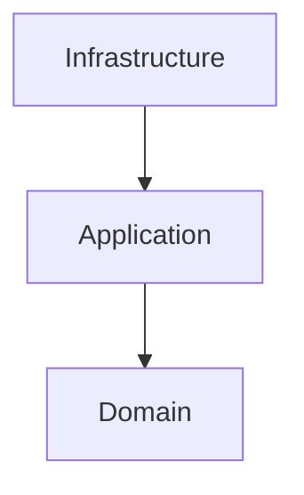
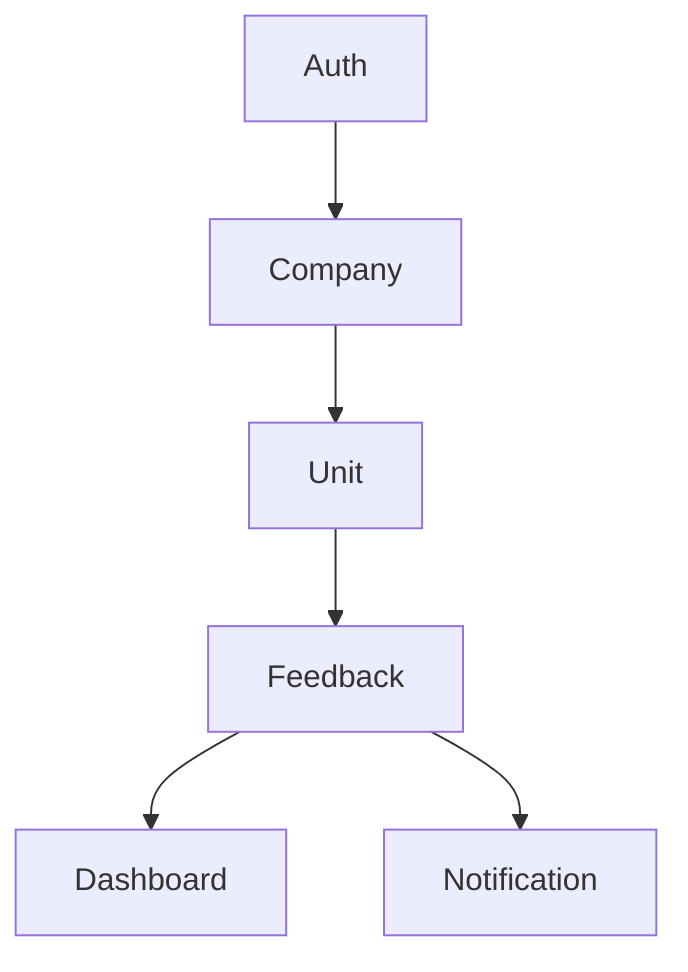

# Architecture

## Overview

Feedback Platform é uma plataforma SaaS multi-tenant para coleta e análise de feedbacks de clientes através de pesquisas NPS.

O sistema permite que empresas criem unidades, gerem QR Codes e acompanhem indicadores de satisfação em dashboards analíticos.

---

## High Level Architecture

```mermaid
flowchart LR

    User[Usuário]

    Web[Angular Web App]

    API[NestJS API]

    MySQL[(MySQL)]

    Redis[(Redis)]

    Worker[BullMQ Workers)]

    User --> Web

    Web --> API

    API --> MySQL

    API --> Redis

    Redis --> Worker

    Worker --> MySQL
```

---

## Architecture Style

### Frontend

- Angular
- TypeScript

### Backend

- NestJS
- Modular Monolith
- Clean Architecture por Módulo

### Database

- MySQL
- Prisma ORM

### Cache & Queue

- Redis
- BullMQ

### Infrastructure

- Docker
- GitHub Actions

---

## Monorepo Structure

```text
apps/
├── api
└── web

packages/
├── shared-types
└── shared-ui

docs/

infra/
```

---

## Backend Structure

```text
src/

core/
├── database/
├── config/
├── health/
└── logger/

modules/
├── auth/
├── company/
├── unit/
├── feedback/
├── dashboard/
└── notification/
```

### Core

Componentes técnicos compartilhados por toda a aplicação.

Exemplos:

- Database
- Configurações
- Health Checks
- Logging
- Filas

### Modules

Domínios de negócio independentes.

Cada módulo encapsula suas regras de negócio e implementações técnicas.

---

## Clean Architecture

Cada módulo seguirá a estrutura:

```text
module/

├── domain/
│   ├── entities/
│   ├── repositories/
│   └── errors/
│
├── application/
│   ├── dto/
│   └── use-cases/
│
├── infrastructure/
│   ├── controllers/
│   ├── repositories/
│   └── persistence/
│
└── module.ts
```

### Responsabilidades

#### Domain

Contém regras de negócio puras.

Não depende de:

- NestJS
- Prisma
- MySQL
- Redis

#### Application

Contém os casos de uso da aplicação.

Exemplos:

- RegisterUserUseCase
- LoginUserUseCase
- CreateCompanyUseCase

#### Infrastructure

Contém implementações técnicas.

Exemplos:

- Controllers
- Prisma Repositories
- Providers
- External Services

---

## Dependency Flow



As camadas internas nunca dependem das externas.

---

## Application Modules



---

## Multi-Tenancy

Estratégia:

- Shared Database
- Shared Schema

Todos os registros de negócio serão associados a uma empresa através do campo:

```text
companyId
```

O isolamento entre clientes será realizado pela camada de aplicação.

---

## Future Integrations

Planejadas para versões futuras:

- Email Notifications
- WhatsApp
- AI Classification
- Payment Gateway

---

## Related ADRs

- ADR-001 Monorepo
- ADR-002 Angular
- ADR-003 NestJS
- ADR-004 MySQL
- ADR-005 Prisma
- ADR-006 JWT Authentication
- ADR-007 Redis + BullMQ
- ADR-008 Modular Monolith
- ADR-009 Multi-Tenancy
- ADR-010 API First
- ADR-011 Core / Modules
- ADR-012 Clean Architecture por Módulo
