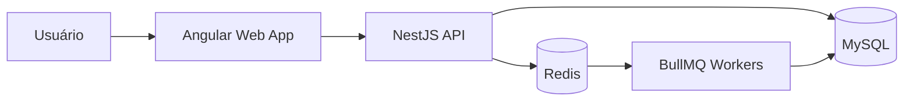
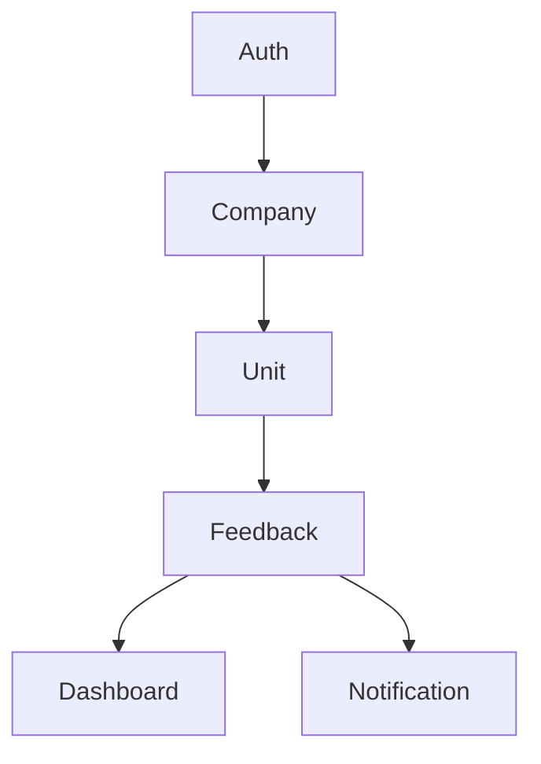

# Architecture

## Overview

Feedback Platform é uma plataforma SaaS multi-tenant para coleta e análise de feedbacks de clientes através de pesquisas NPS.

O sistema permite que empresas criem unidades, gerem QR Codes e acompanhem indicadores de satisfação em dashboards analíticos.

---

## High Level Architecture



---

## Architecture Style

### Frontend

- Angular
- TypeScript

### Backend

- NestJS
- Modular Monolith

### Database

- MySQL

### Cache & Queue

- Redis
- BullMQ

### Infrastructure

- Docker
- GitHub Actions

---

## Monorepo Structure

```text
apps/
├── api
└── web

packages/
├── shared-types
└── shared-ui

docs/

infra/
```

---

## Application Modules



---

## Multi-Tenancy

Estratégia:

- Shared Database
- Shared Schema

Todos os registros de negócio serão associados a uma empresa através do campo:

```text
companyId
```

O isolamento entre clientes será realizado pela camada de aplicação.

---

## Future Integrations

Planejadas para versões futuras:

- Email Notifications
- WhatsApp
- AI Classification
- Payment Gateway

---

## Related ADRs

- ADR-001 Monorepo
- ADR-002 Angular
- ADR-003 NestJS
- ADR-004 MySQL
- ADR-005 Prisma
- ADR-006 JWT Authentication
- ADR-007 Redis + BullMQ
- ADR-008 Modular Monolith
- ADR-009 Multi-Tenancy
- ADR-010 API First
